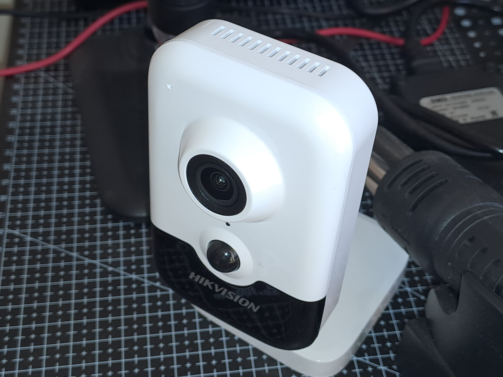
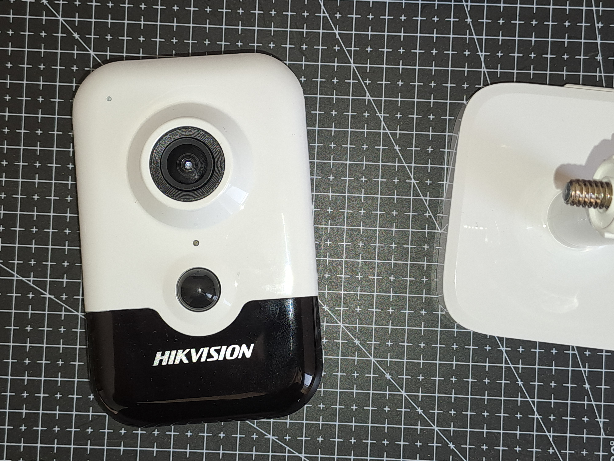
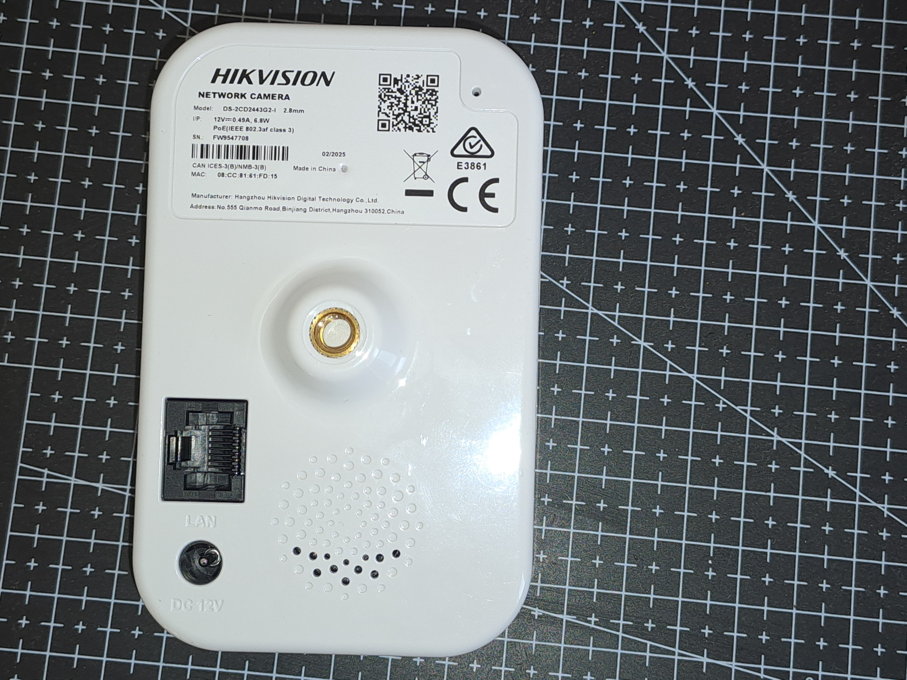
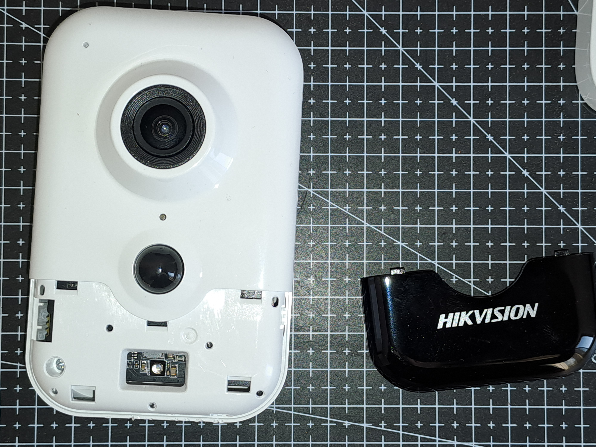
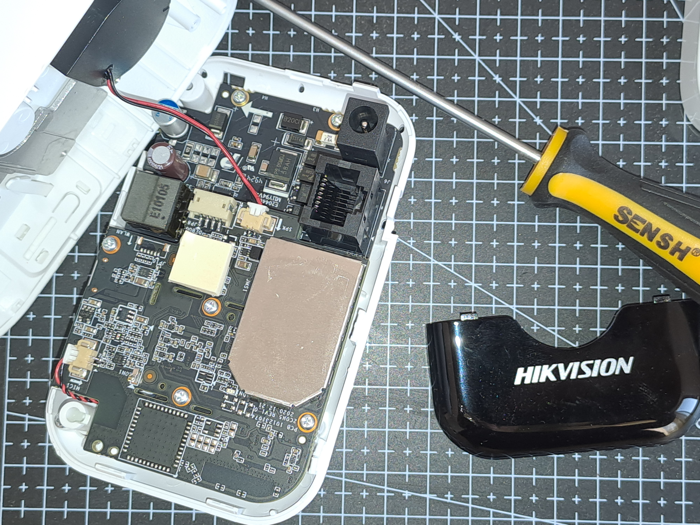
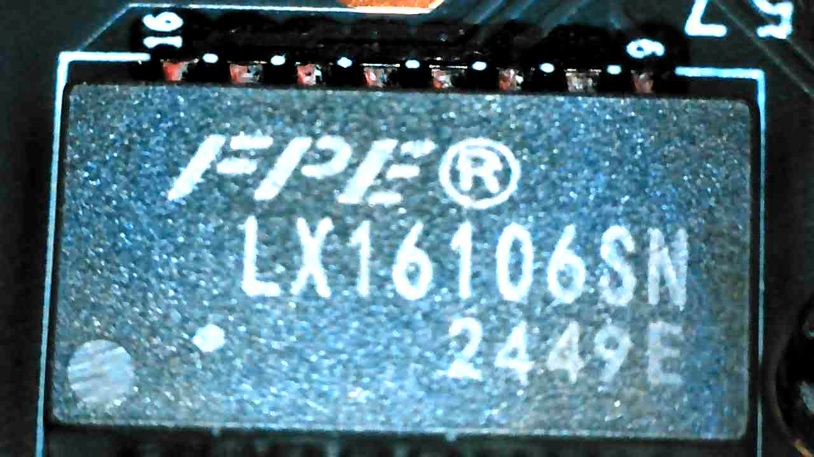

# Hikvision DS-2CD2446G2-I IP Camera

The **DS-2CD2446G2-I** is an IP camera without any internal stepper motors, rotation must be performed manually. Its firmware is identified under the same code name: `DS-2CD2446G2-I`.

---

## Teardown Procedure

1. Detach the camera head from the stand.  
2. Carefully pry off the black front cover.  
3. Remove the screw using a **PH0 screwdriver**.  
4. Use a pry tool to separate the upper chassis.  
5. Unscrew and detach the circuit boards.  

  
  
  
  
  
  
  
  
  

---

## Circuit Boards

After disassembly, the following circuit boards are obtained:

### Board id: `451021191201588`

  
  

It has the following components

| Label                | Description                      | Microscope Image                                          |
|----------------------|----------------------------------|-----------------------------------------------------------|
| FPE LX16106SN 2449E  | 10/100 Base-T transformer Module |  |
|                      |                                  |                                                           |
|                      |                                  |                                                           |
|                      |                                  |                                                           |

### Board id: `451022069200071`

  
  

---

## Firmware

Firmware for the DS-2CD2446G2-I can be downloaded from both **EU** and **CN** official websites.  
It is important to note that Hikvision often applies **different firmware codes** for non-CN releases.

