# Hikvision DS-2CD2446G2-I IP Camera

The **DS-2CD2446G2-I** is an IP camera without any internal stepper motors, rotation must be performed manually. Its firmware is identified under the same code name: `DS-2CD2446G2-I`.

---

## Teardown Procedure

1. Detach the camera head from the stand.  
2. Carefully pry off the black front cover.  
3. Remove the screw using a **PH0 screwdriver**.  
4. Use a pry tool to separate the upper chassis.  
5. Unscrew and detach the circuit boards.  

  
  
  
  
  
  
  
  
  

---

## Circuit Boards

After disassembly, the following circuit boards are obtained:

### Board id: `451021191201588` (PCB 101214957, 2017.08.04)

  
  

It has the following components

| Label                | Description                                   | Microscope Image                                          |
|----------------------|-----------------------------------------------|-----------------------------------------------------------|
| FPE LX16106SN 2449E  | 10/100 Base-T transformer Module              |  |
| PIR AM312            | Motion sensor/IR detector                     | 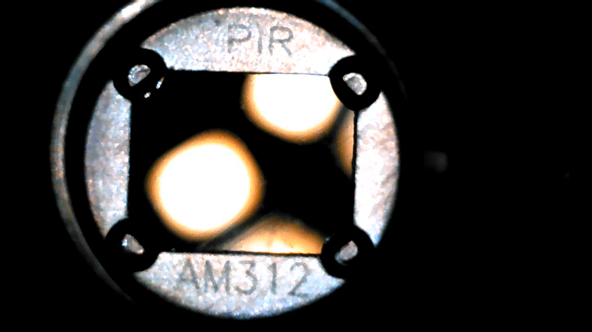 |
| E10105               | External clock?                               | 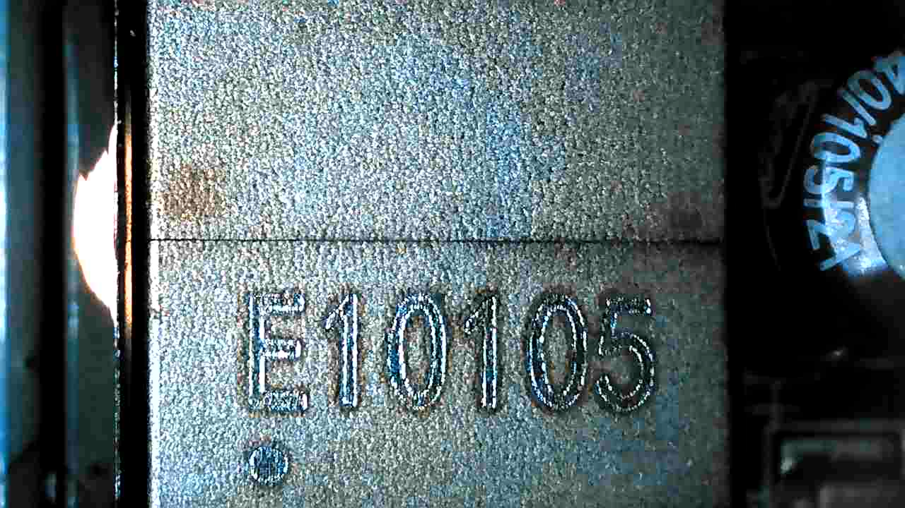 |
| ??? 420 SS210        | Schottky Barrier Rectifier Diode              | 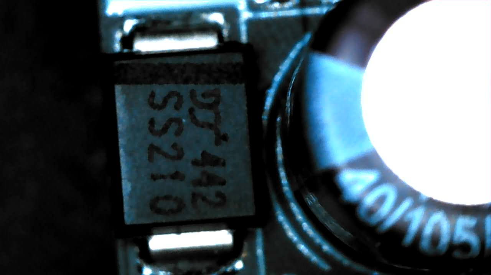 |
| SS34BA               | Schottky Barrier Rectifier Diode              | 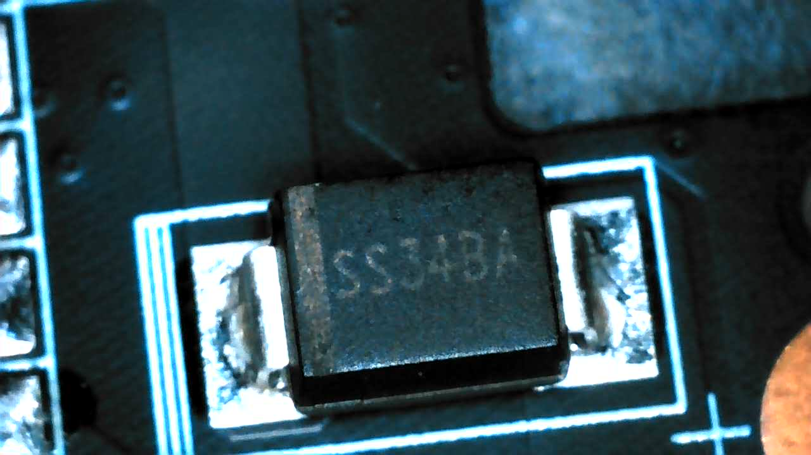 |
| MPSS08 M8007H 84507A | Ethernet IC?                                  | 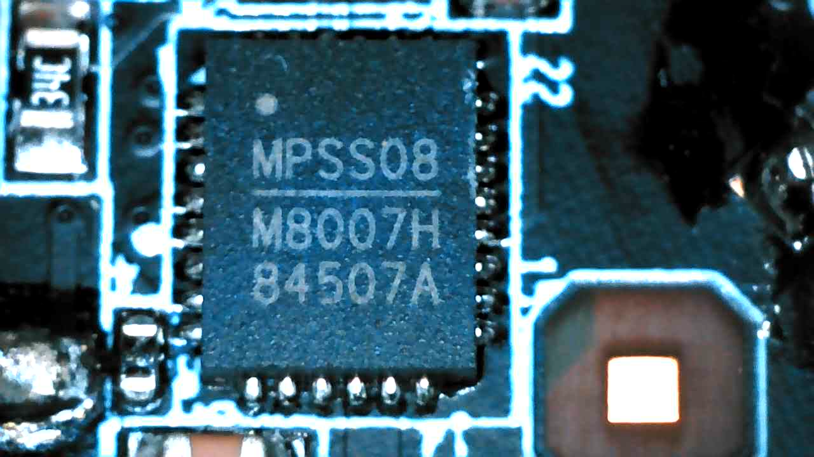 |
| P5. 0SMDJ 58AH       | Transient Voltage Suppressors                 | 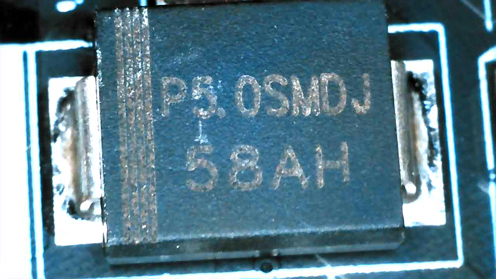 |
| B20CI                | Voltage regulator diaode                      | 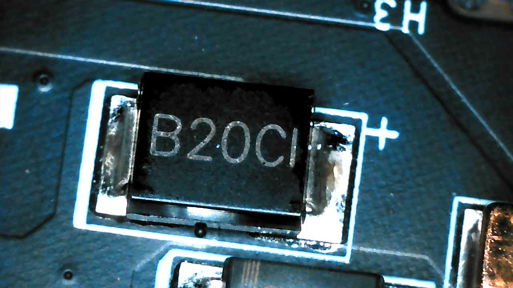 |
| SS14A                | Schottky Barrier Rectifier Diode              | 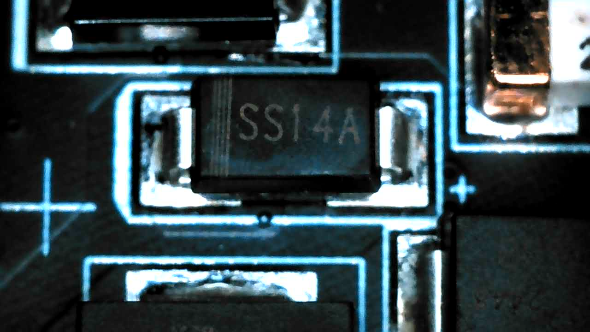 |
| 2448 T58B            | ?                                             | 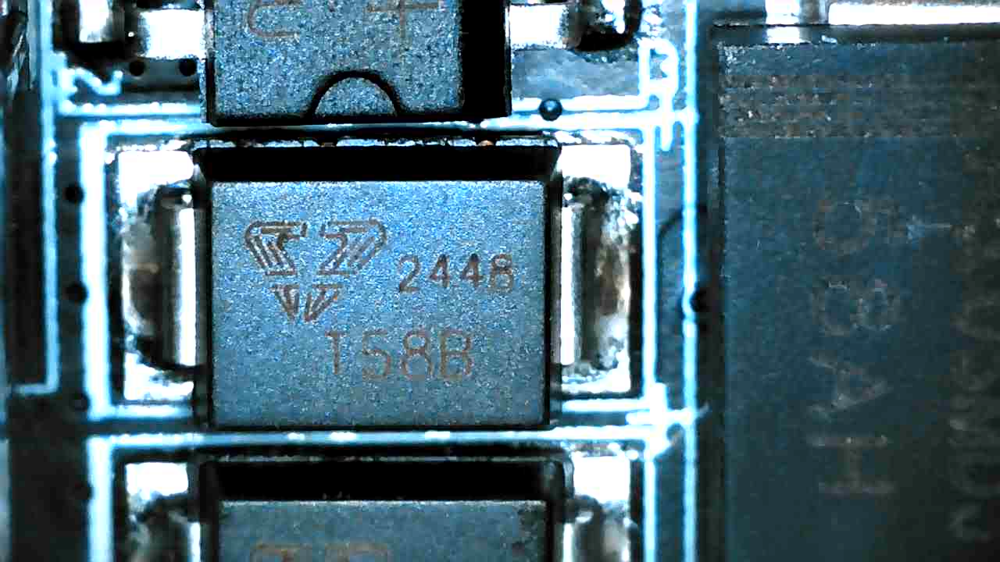 |
| MB6SU                | Single-phase full bridge rectifier (AC to DC) | 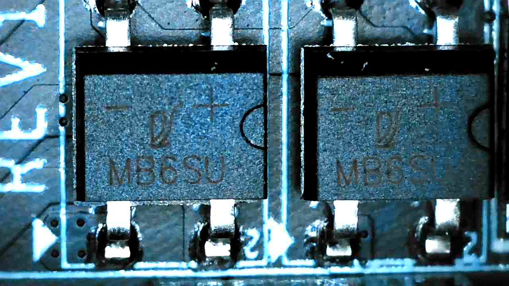 |

### Board id: `451022069200071` (PCB 101231074, 2020.12.21)

  
  

It has the following components

| Label                              | Description                                   | Microscope Image                                          |
|------------------------------------|-----------------------------------------------|-----------------------------------------------------------|
| M4Y04                              | Oscillator? Capacitor?                        | 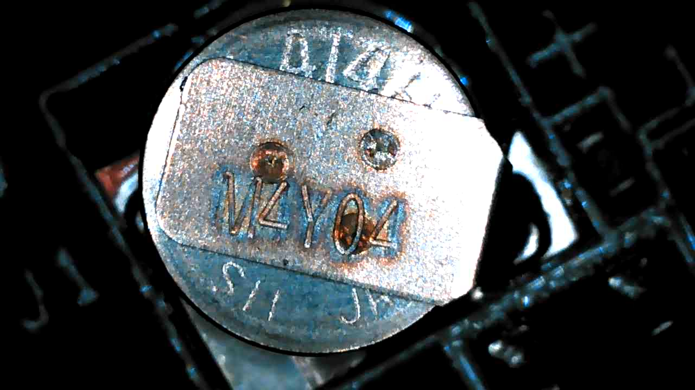 |
| AAC 6842                           | PWM Controller IC?                            | 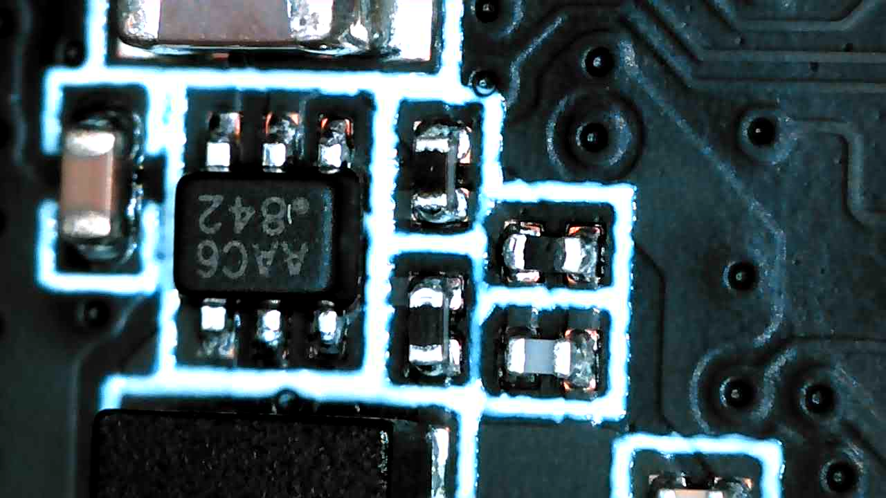 |
| SEC 216 K4B2G16 46F BYMA YEN21810  | Samsung DDR3 SDRAM                            | 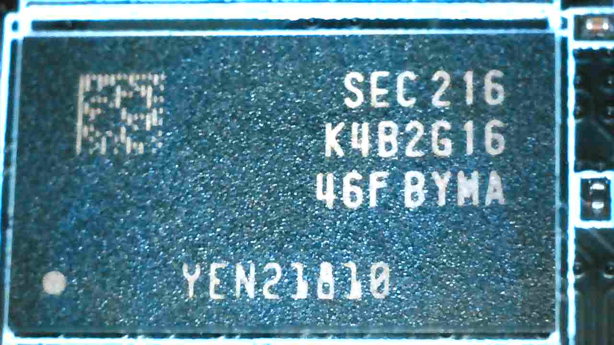 |
| HK-2019-A17 TMBR0500 2322-BB       | Wi-Fi SoC?                                    | 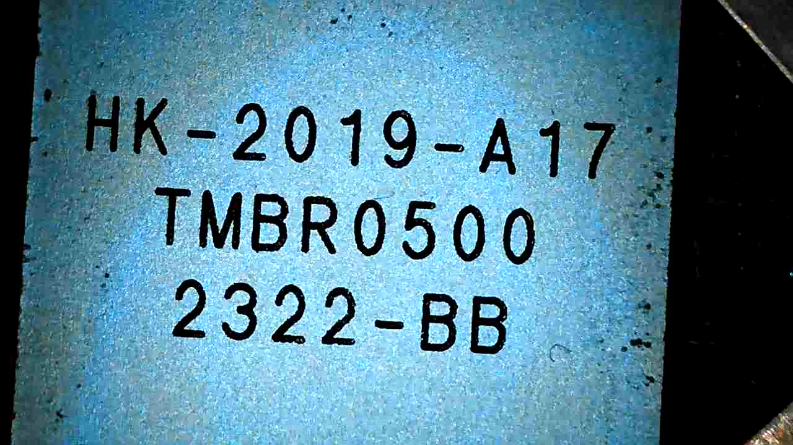 |
| SEC 218 K4B2616 46F BYMA YEN22211  | Samsung DDR3 SDRAM                            | 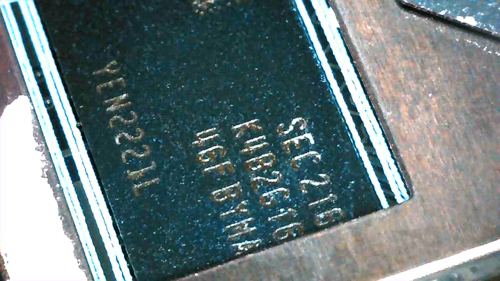 |
| Winbond 25N01GVZEIG 2419 640757100 | NAND Flash Memory                            | 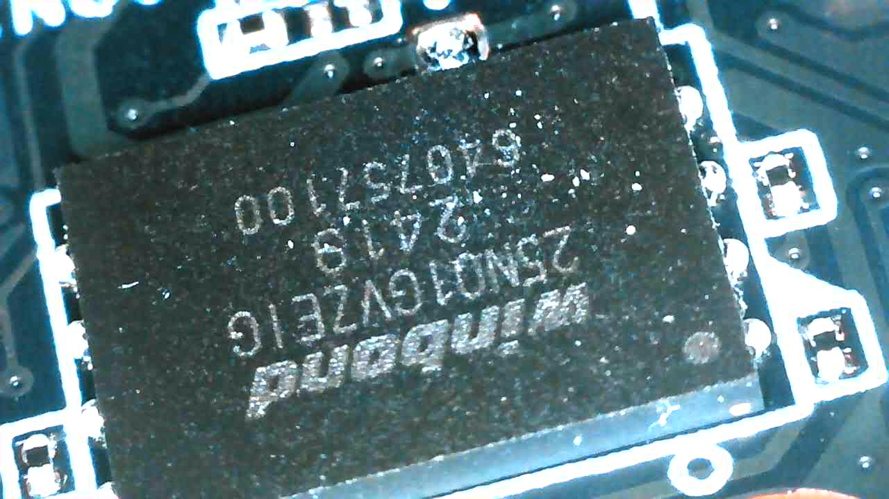 |

---

## Flash ROM

It's a Winbond NAND Flash:
- Size: 128MB
- Protocol: SPI
- Voltage: 2.7-3.6V
- Frequency: 104Mhz

## Firmware

Firmware for the DS-2CD2446G2-I can be downloaded from both **EU** and **CN** official websites.  
It is important to note that Hikvision often applies **different firmware codes** for non-CN releases.

